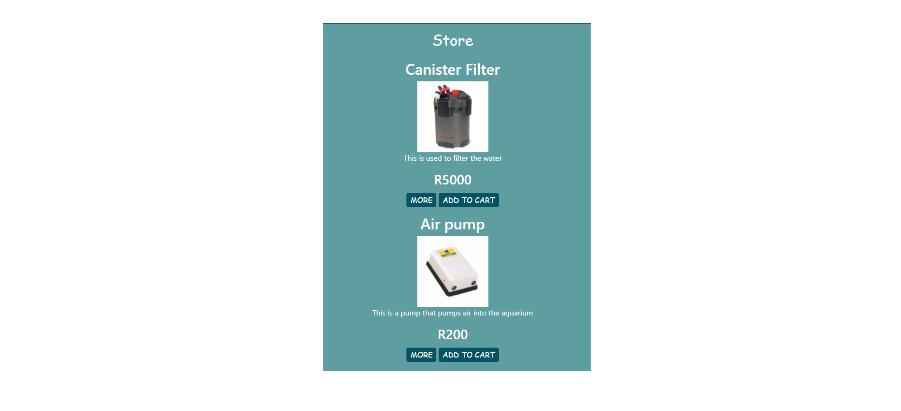

# Fish-store-JavaScrip

### The purpose of this project 
 This was the final capstone project for Level 1 one in the Hyperion Dev 
 bootcamp. In this project you had to build a functional cart for a web store.
 In this Project I used Javascript and Jquery to give the site some functionality.

#### Index 
 * How to install on your pc 
 * Dynamically created pages  
 * The cart 
 * The use of jquery
 * Credits 

#### How to install 
 1. Download the repository and open with Google Chrome. 
 1. Use the loadProducts() function in the store.js file to add products to your store.
 1. Save your images in the img folder. 

#### Dynamically created pages
 
 This picture demonstrates how an item looks in the store after you added the item. 
 This is dynamically created  by javascript.
 
 You also get an item page generated for you. On this page you can display extra info on your product.

#### The Cart 
 If you add an item to your cart will calculate the total. You can also add discount and vat to your total.

#### Jquery
 This store also makes use of Jquery to introduce some effects. Bootstrap
 is used for making the store mobile friendly.

### Credits 
 Johannes Nefdt 
